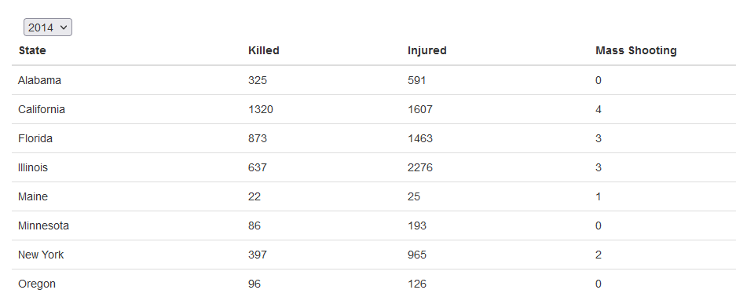
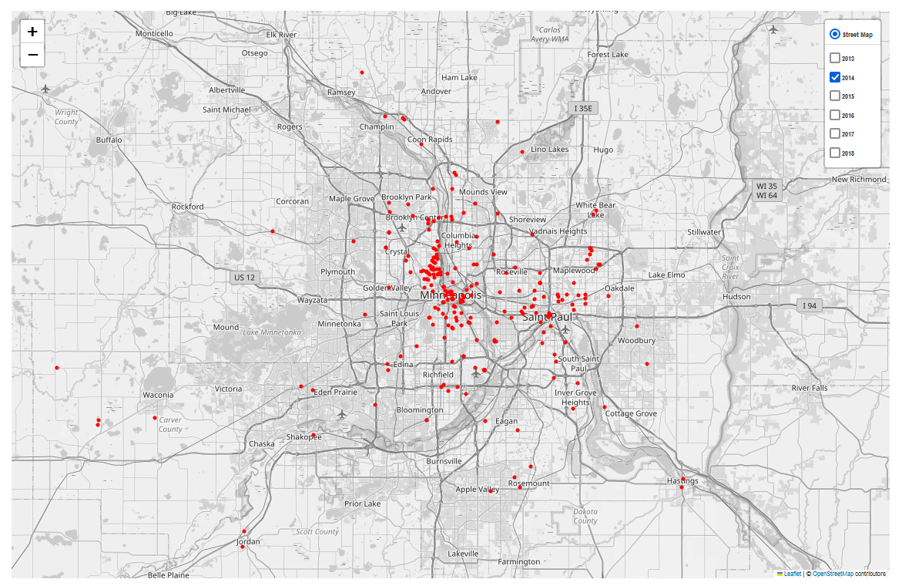

# Project 3: Gun Violence in Minnesota Dashboard

### Contributors:
- "Alice" Lan Nguyen
- Arnold Miranda Reynoso
- Jacob Anderson (delete this)
- MaiDao Lor

### Project Overview
This project focuses on the geographical distribution of gun-related incidents within the states of California, Oregon, Minnesota, Illinois, New York, Maine, Florida, and Alabama. 
Our analysis include a comparative examination of trends over a specific year relative to the entirety of the dataset’s temporal span. This approach will enable us to gain valuable insights into the development of gun-related incidents over time. 

### Data Source
- https://www.kaggle.com/datasets/jameslko/gun-violence-data
- https://www.kaggle.com/datasets/alexandrepetit881234/us-population-by-state

### Cleaning and Loading
We downloaded the 2 csv files from Kaggle.com and saved them in the 'Resource' folder. We then imported the 2 csv files into the Jupyter Notebook 'main.ipynb'. We merged the 2 files together based on state and began the cleaning process. Here, we removed all the columns and data points that were not needed for the project. We then changed the column names and data type and checked for any duplicates. We created a second dataframe that will be used for analysis and visualization. Because the data in 2013 and 2018 were incompleted, we decided to only include data from 2014 to 2017 in the second dataset.

We then loaded these 2 datasets into Postgres and also saved them as a JSON file.

### Dashboard Feature
The dashboard includes several features that enable users to explore and analyze gun violence in Minnesota and other states. 
On the top of the page is an interactive table that displays all the states, number of of killed, injured and mass shooting in a year. User can toggle between the years by using the drop down menu on the top left of the table.

Below the table is an interactive map that shows the locations of all the gun violence incidents from 2013 to 2018. Each mark also include a popup that show the date of the incident and number of killed and injured. User can choose to look at data from a different year or include multiple years data by clicking on the tick boxes on the top right of the map.

Then, we have a bar graph that displays the deaths vs injuries over the course of multiple years. We set the default to Minnesota but user can choose other states by using the drop down menu on the top left of the graph 

Last but not least, we have a line chart that display gun violence incidents over the course of one year in Minnesota. User can choose a different year using the drop down menu on the top left of the graph.

### Getting Started
To get started with this project, follow the steps below:
1. Clone the repository to your local machine using git clone https://github.com/LanNguyen135/Project3.git
2. Ensure you have Python 3.7 or later installed on your machine.
3. Set up a PostgreSQL database by running the gunViolence.sql and metadata.sql script in the schema folder.
4. Insert your PostgreSQL password in password.py file
5. Run the Flask app by running python app.py in your terminal.
6. Navigate to http://127.0.0.1:5000/ in your web browser to use the application.

### Future Work
For the future, we would like to expand our research to cover the entire United States. We also want to cover a longer period of time. Which can potential reveal interesting trends about gun violence.

### Credit
- Instructor: Hunter Hollis
- TA: Sam Espe
- TA: Randy

